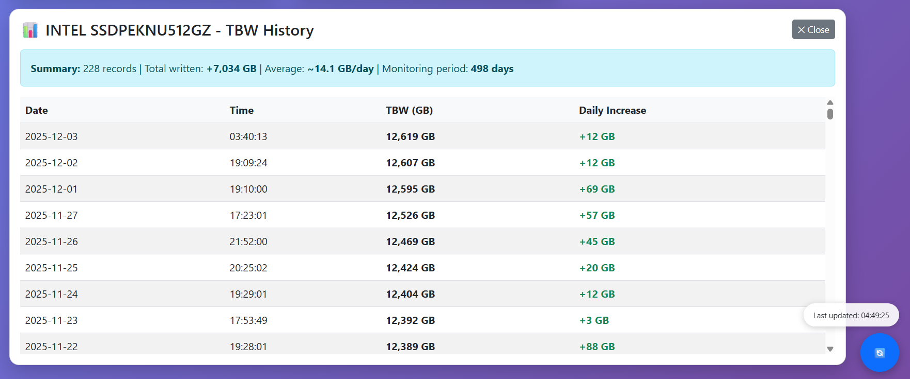

# SSD TBW Monitor

> Windows service for automated SSD Total Bytes Written (TBW) tracking with web dashboard.

[](https://www.oracle.com/java/)
[](https://spring.io/projects/spring-boot)
[](https://www.sqlite.org/)

## 📋 Overview

**SSD TBW Monitor** is a lightweight Windows service that automatically tracks Total Bytes Written (TBW) for SSDs using SMART data. It provides a web-based dashboard for visualization and historical analysis, helping users monitor SSD health and predict lifespan.

### Key Features

- 🔍 **Automatic SSD Detection** - Scans and registers all connected SSDs via smartmontools
- 📊 **Daily TBW Recording** - Automatically logs TBW values between 5:00 PM - 12:00 AM
- 🌐 **Web Dashboard** - Clean, responsive interface accessible via browser
- 🔄 **Clock Manipulation Detection** - Auto-restarts service if system time is changed
- 💾 **SQLite Database** - Lightweight, zero-configuration storage
- 🪟 **Windows Service** - Runs in background, starts automatically on boot
- 🌍 **Internet Time Sync** - Uses external time API for accurate timestamps

## 🖼️ Screenshots

<details>
<summary>Click to expand</summary>

### Dashboard Overview

*View all registered SSDs with current TBW values and monitoring status*

### Daily Records

*Click any SSD to view detailed historical TBW data with daily increments*

### Windows Service

*Service runs automatically in background as "TBW Monitor"*

### Installer Wizard

*One-click installation with automatic dependency detection*

</details>

## 🛠️ Tech Stack

**Backend:**
- Java 21
- Spring Boot 3.4.0
- Spring Data JPA
- SQLite
- TimeAPI.io (time synchronization)

**Frontend:**
- HTML5, CSS3, Vanilla JavaScript
- Bootstrap 5
- Embedded in Spring Boot static resources

**Tools:**
- smartmontools (SMART data retrieval)
- NSSM (Windows service wrapper)
- NSIS (installer creation)

## 📦 Installation

### Prerequisites

- Windows 10/11 (64-bit)
- Java Runtime Environment 21+
  - Download: [Eclipse Temurin JRE 21](https://adoptium.net/temurin/releases/?version=21)
- **Internet connection** (required for accurate time synchronization)

### Quick Install

1. **Download the installer:**
   - Go to [Releases](../../releases)
   - Download `TBWMonitorInstaller.exe`

2. **Run the installer:**
   - Right-click → **Run as Administrator**
   - Follow the installation wizard
   - Installer will automatically:
     - Detect Java 21+ (prompts to download if missing)
     - Install smartmontools (if needed)
     - Configure Windows service
     - Start the service

3. **Access the dashboard:**
   - Open browser: `http://localhost:8085`

## 🚀 Usage

### Web Dashboard

1. Navigate to `http://localhost:8085`
2. View all registered SSDs with current TBW values
3. **Click any SSD card** to view detailed historical records
4. Click the **🔄 refresh button** (bottom-right) to:
   - Detect new SSDs
   - Register TBW records
   - Update dashboard data

### Dashboard Features

- **SSD Cards:** Shows model, serial, capacity, and latest TBW
- **Status Badges:** 
  - ✓ Active = Monitoring enabled
  - ○ Inactive = Monitoring disabled
- **Historical Data:** Click any card to view daily TBW progression
- **Statistics:** View total written data, daily averages, and monitoring period

### Windows Service Management

**Using Windows Services (services.msc):**
1. Press `Win + R`, type `services.msc`, press Enter
2. Find "TBW Monitor" in the list
3. Right-click → Start/Stop/Restart

**Note:** The service is managed entirely through Windows Services. NSSM is used internally by the installer but is not needed for day-to-day operation.

## 🔧 Configuration

### Port Configuration

Default port: `8085`

**Note:** Configuration files are embedded in the JAR. To change the port:
```cmd
java -Dserver.port=YOUR_PORT -jar C:\TBWMonitor\ssd-tbw-monitoring-api-0.0.1-SNAPSHOT.jar
```

**Installation directory contents:**
```
C:\TBWMonitor\
├── data/                           # SQLite database
├── logs/                           # Service logs
├── nssm.exe                        # Service wrapper (internal use)
├── ssd-tbw-monitoring-api-0.0.1-SNAPSHOT.jar
└── Uninstall.exe
```

### Monitoring Schedule

TBW is automatically recorded daily between **5:00 PM - 12:00 AM**.

To modify, edit `TbwSchedulerService.java`:
```java
private static final LocalTime START_TIME = LocalTime.of(17, 0);
private static final LocalTime END_TIME = LocalTime.of(0, 0);
```

## 📁 Project Structure

```
ssd-tbw-monitor/
├── docs/
│   └── screenshots/            # Documentation images
├── installer/
│   ├── nssm.exe                   # Service wrapper
│   ├── smartmontools-7.4-1.win32-setup.exe
│   └── TBW Monitor SCRIPT.nsi   # Installer script
├── src/
│   ├── main/
│   │   ├── java/com/cristianml/SSDMonitoringApi/
│   │   │   ├── config/        # App configuration
│   │   │   ├── controller/    # REST endpoints
│   │   │   ├── domain/        # Entity models
│   │   │   ├── dto/           # Data transfer objects
│   │   │   ├── mapper/        # Entity-DTO mappers
│   │   │   ├── repository/    # Data access
│   │   │   ├── service/       # Business logic
│   │   │   └── utilities/     # Helper classes
│   │   └── resources/
│   │       ├── static/        # Frontend (HTML/CSS/JS)
│   │       └── application.properties
│   └── test/
├── .gitignore
├── mvnw
├── mvnw.cmd
└── pom.xml
```

## 🐛 Troubleshooting

### Service won't start

**Symptom:** Service shows "Stopped" in Windows Services

**Solutions:**
1. Check logs: `C:\TBWMonitor\logs\service-error.log`
2. Verify Java is installed: `java -version`
3. Test manually:
   ```cmd
   cd C:\TBWMonitor
   java -jar ssd-tbw-monitoring-api-0.0.1-SNAPSHOT.jar
   ```
4. Check Windows Event Viewer: `eventvwr.msc` → Windows Logs → Application

### Dashboard shows no SSDs

**Symptom:** Empty SSD list or "No SSDs Registered Yet" message

**Solutions:**
1. Click the **🔄 refresh button** to detect SSDs
2. Verify smartmontools is installed:
   ```cmd
   smartctl --version
   ```
3. Run smartctl manually to see your drives:
   ```cmd
   smartctl --scan
   ```
4. Check service has admin rights (required for SMART access)
5. Restart the service after smartmontools installation

### Cannot access dashboard

**Symptom:** Browser shows "Cannot connect to localhost:8085"

**Solutions:**
1. Verify service is running: Open `services.msc`, find "TBW Monitor"
2. Check firewall isn't blocking port 8085
3. Try: `http://127.0.0.1:8085`
4. Check port isn't in use:
   ```cmd
   netstat -ano | findstr :8085
   ```
5. Review service logs: `C:\TBWMonitor\logs\service-error.log`

### Clock manipulation warnings

**Symptom:** Service restarts unexpectedly, logs show "CLOCK MANIPULATION DETECTED"

**Explanation:** This is intentional. The service detects system time changes (>2 minutes difference) and automatically restarts to maintain data integrity.

**Common causes:**
- Manually changing system date/time
- System waking from hibernation/sleep
- Time zone changes
- NTP synchronization with large time drift

**Recommendation:** Keep your system clock accurate and avoid manual time changes.

### Time synchronization issues

**Symptom:** "No internet connection" errors or incorrect timestamps

**How it works:**
- The service uses **TimeAPI.io** (https://timeapi.io) to fetch accurate timestamps
- API endpoint: `https://timeapi.io/api/Time/current/zone?timeZone=America/La_Paz`
- This prevents users from manipulating dates to create fraudulent TBW records

**Solutions:**
1. **Ensure internet connectivity** - Service requires internet for accurate time validation
2. Check if TimeAPI is accessible:
   ```cmd
   curl "https://timeapi.io/api/Time/current/zone?timeZone=America/La_Paz"
   ```
3. **Without internet:**
   - Service will use system time but cannot validate against manipulation
   - TBW recording will continue, but records may be created with system dates
   - When internet is restored, service will detect future-dated records and **automatically delete them**
4. Enable Windows Time Service for backup:
   ```cmd
   sc config w32time start= auto
   net start w32time
   ```

**Important:** If you change your system date/time while offline, those records will be removed when internet connection is restored and the service detects they are dated in the future.

### Database errors

**Symptom:** Errors about database access or corrupted data

**Solutions:**
1. Stop service via `services.msc`
2. Backup your database:
   ```cmd
   copy C:\TBWMonitor\data\tbw_monitor.db C:\TBWMonitor\data\tbw_monitor_backup.db
   ```
3. If database is corrupted, delete and restart service to recreate:
   ```cmd
   del C:\TBWMonitor\data\tbw_monitor.db
   ```

**Note:** This application uses SQLite in simple JDBC mode. Only `tbw_monitor.db` is created (no `-shm` or `-wal` files).

## 🔨 Building from Source

### Prerequisites
- JDK 21
- Maven 3.8+
- smartmontools (for testing)

### Build Steps

```bash
# Clone repository
git clone https://github.com/srDesho/ssd-tbw-monitor.git
cd ssd-tbw-monitor

# Build
mvn clean package

# Run locally
java -jar target/ssd-tbw-monitoring-api-0.0.1-SNAPSHOT.jar

# Access at http://localhost:8085
```

### Create Installer

1. Build the JAR (see above)
2. Install NSIS: https://nsis.sourceforge.io/
3. Copy built JAR to `installer/` directory
4. Place required files in `installer/`:
   - `ssd-tbw-monitoring-api-0.0.1-SNAPSHOT.jar`
   - `nssm.exe`
   - `smartmontools-7.4-1.win32-setup.exe`
5. Right-click `TBW Monitor SCRIPT.nsi` → **Compile NSIS Script**
6. Output: `TBWMonitorInstaller.exe`

## 📊 API Endpoints

The service exposes REST endpoints at `http://localhost:8085/ssds`:

| Endpoint | Method | Description |
|----------|--------|-------------|
| `/ssds` | GET | List all registered SSDs with TBW records |
| `/ssds/detect` | GET | Scan for SSDs using smartmontools |
| `/ssds/detect-and-register` | POST | Detect and register new SSDs |
| `/ssds/{id}/monitor` | PATCH | Toggle monitoring for specific SSD |
| `/ssds/all` | GET | Detect SSDs, record TBW, return all data |

### How the Dashboard Uses the API

The web interface interacts with these endpoints:

- **On page load:** Calls `/ssds` to display registered SSDs
- **🔄 Refresh button:** Calls `/ssds/all` (detects new SSDs + records TBW + refreshes data)
- **Click SSD card:** Displays historical records from the loaded data

**Note:** The dashboard does NOT auto-refresh. Data is updated only when you click the 🔄 button.

### Manual API Testing (Optional)

You can test endpoints manually using tools like Postman or curl:

```bash
# View all SSDs (what the dashboard loads)
curl http://localhost:8085/ssds

# Trigger detection and recording (what refresh button does)
curl http://localhost:8085/ssds/all

# Enable monitoring for SSD with ID 1
curl -X PATCH "http://localhost:8085/ssds/1/monitor?monitor=true"
```

**Note:** The dashboard is a static HTML page that makes direct JavaScript fetch calls to these endpoints. It does not use URL routing like traditional SPAs.

## ⚠️ Important Notes

### Internet Connection Recommended
- The service uses **TimeAPI.io** to validate system time and prevent date manipulation
- **With internet:** Full protection against fraudulent backdated records
- **Without internet:** 
  - Service will continue recording TBW using system time
  - If system date is manipulated while offline, records will be created
  - **When internet is restored:** Service detects future-dated records and automatically deletes them
  - Recommendation: Keep internet connected for data integrity

### Time Manipulation Detection & Protection
- **Clock drift detection:** If system time changes by >2 minutes, service automatically restarts
- **Future date protection:** When internet is restored after being offline:
  - Service fetches current date from TimeAPI.io
  - Compares against database records
  - **Automatically deletes any records dated in the future**
  - This prevents fraudulent data even if dates were manipulated while offline
- **Best practice:** Keep system time accurate via NTP/Windows Time Service

### Monitoring Schedule
- TBW is recorded **once daily** between 5:00 PM - 12:00 AM
- First detection after 5:00 PM triggers recording
- No duplicate records per day per SSD
- Updates existing record if TBW increases by ≥3 GB on the same day

## 🤝 Contributing

Contributions are welcome! Please feel free to submit a Pull Request.

1. Fork the project
2. Create your feature branch (`git checkout -b feature/AmazingFeature`)
3. Commit your changes (`git commit -m 'Add some AmazingFeature'`)
4. Push to the branch (`git push origin feature/AmazingFeature`)
5. Open a Pull Request

## 📄 License

This project is licensed under the MIT License - see the [LICENSE](LICENSE) file for details.

## 👤 Author

**Cristian Montaño Laime**
- GitHub: [@srDesho](https://github.com/srDesho)
- LinkedIn: [Cristian Montaño Laime](https://www.linkedin.com/in/cristianmont/)

## 🙏 Acknowledgments

- [smartmontools](https://www.smartmontools.org/) - SMART monitoring utility
- [NSSM](https://nssm.cc/) - Windows service wrapper
- [TimeAPI.io](https://timeapi.io/) - Time synchronization service

---

⭐ **Star this repo** if you find it useful! Open source project for the community.